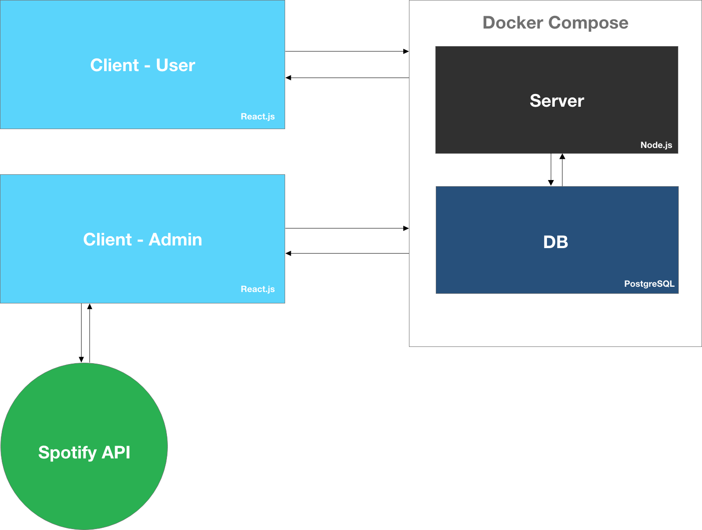

# Architecture

# Roadetrix Records
Production: [https://roadetrix-staging.herokuapp.com/](https://roadetrix-staging.herokuapp.com/)  
Staging: [https://roadetrix-staging.herokuapp.com/](https://roadetrix-staging.herokuapp.com/)  

## Developers
[Josiah Roa](https://github.com/josiahroa18)

## Dependencies
| Dependency | URL       |
|------------|-----------|
| express        | [docs](https://expressjs.com/en/4x/api.html) |
| pg             | [npm](https://www.npmjs.com/package/pg) |
| knex           | [docs](http://knexjs.org/) |
| bcryptjs       | [npm](https://www.npmjs.com/package/bcryptjs) |
| jsonwebtoken   | [npm](https://www.npmjs.com/package/jsonwebtoken) |

## Environments
Different enviornments set up different connections to either a production database or local development database.
- The **development** environment is ran by running `npm run server` in the terminal
- The **production** enviornment is ran by running `npm start` in the terminal

## Enviornment Variables
- DATABASE_URL - the url for the database
- ADMIN_USERNAME (optional on development) - the username to be used for the admin account
- ADMIN_PASSWORD (optional on development) - the password to be used for the admin account
- PORT (optional on development) - specifies which port to run the server on
- DB_ENV (optional on development) - specifies the enviormnet for the database
- JWT_SECRET (optional on development) - hashing key for the jsonwebtoken secret

## Getting Started
To get the server running locally:
- Clone this repo
- Run `npm install`
- Have a postgres database created locally on your system for this server
- Create a `.env` file in the root directory
- Add `DATABASE_URL=database-url-here` 
- Add `ADMIN_PASSWORD=password-here`
- Run `knex migrate:latest` in the same directory as `knexfile.js`
- Run `knex seed:run` in the same directory as `knexfile.js`
- After setup, use `npm run server` to start up the  development server. If
you want to use a different port, and an env variable `PORT=new-port-here`. 

Note: Knex may need to be installed globally for migration and seeds to run. Also, nodemon may need to be installed globally on your system in order to use npm run server.

## Scripts
- `npm run server` - Runs the development environment on your system
- `npm start` - Runs the production environment on your system

## Testing Documentation
There is currently no testing on this application.

## Making Contributions
When contributing to this repository, please first discuss the change you wish to make via issue, email, or any other method with the owners of this repository before making a change.

### Issue/Bug Request
If you are having an issue with the existing project code, please submit a bug report under the following guidelines:

- Check first to see if your issue has already been reported.
- Check to see if the issue has recently been fixed by attempting to reproduce the issue using the latest master branch in the repository.
- Create a live example of the problem.
- Submit a detailed bug report including your environment & browser, steps to reproduce the issue, actual and expected outcomes, where you believe the issue is originating from, and any potential solutions you have considered.

### Feature Requests
We would love to hear from you about new features which would improve this app and further the aims of our project. Please provide as much detail and information as possible to show us why you think your new feature should be implemented.

### Pull Requests
If you have developed a patch, bug fix, or new feature that would improve this app, please submit a pull request. It is best to communicate your ideas with the developers first before investing a great deal of time into a pull request to ensure that it will mesh smoothly with the project.

**Pull Request Guidelines**
- Ensure any install or build dependencies are removed before the end of the layer when doing a build.
- Ensure that your code conforms to our existing code conventions and **test** coverage.
- Include the relevant issue number, if applicable.
- You may merge the Pull Request in once you have the sign-off of two other developers, or if you do not have permission to do that, you may request the second reviewer to merge it for you.